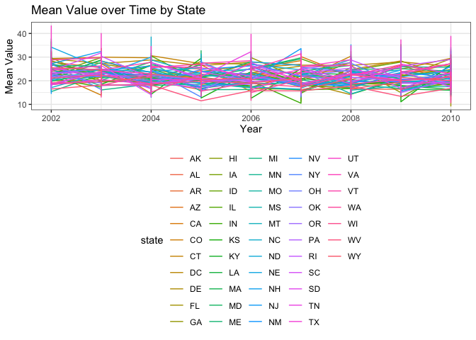
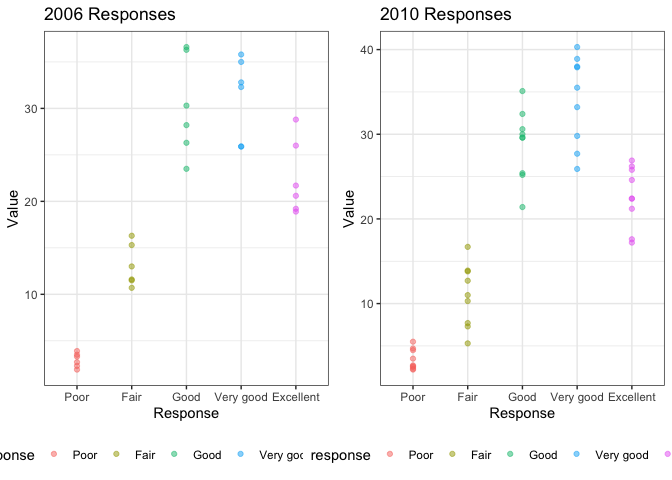
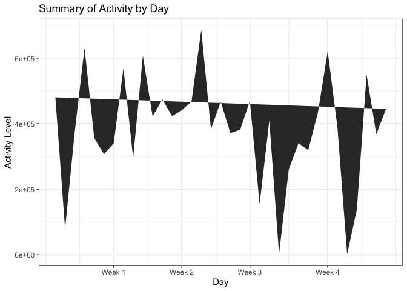
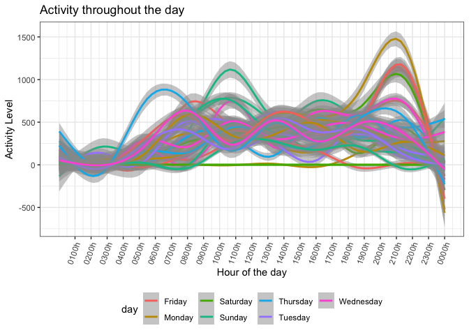

Data Science Homework 3
================
Laura Lynch
10/14/2019

Problem 1

Access instacart data:

``` r
library(p8105.datasets)
data("instacart")

instacart
```

    ## # A tibble: 1,384,617 x 15
    ##    order_id product_id add_to_cart_ord… reordered user_id eval_set
    ##       <int>      <int>            <int>     <int>   <int> <chr>   
    ##  1        1      49302                1         1  112108 train   
    ##  2        1      11109                2         1  112108 train   
    ##  3        1      10246                3         0  112108 train   
    ##  4        1      49683                4         0  112108 train   
    ##  5        1      43633                5         1  112108 train   
    ##  6        1      13176                6         0  112108 train   
    ##  7        1      47209                7         0  112108 train   
    ##  8        1      22035                8         1  112108 train   
    ##  9       36      39612                1         0   79431 train   
    ## 10       36      19660                2         1   79431 train   
    ## # … with 1,384,607 more rows, and 9 more variables: order_number <int>,
    ## #   order_dow <int>, order_hour_of_day <int>,
    ## #   days_since_prior_order <int>, product_name <chr>, aisle_id <int>,
    ## #   department_id <int>, aisle <chr>, department <chr>

The instacart dataset reflects the business of the instacart online groceryordering service. Order data includes the ailse and deartment information for the product as well as exactly when the order was placed and how frequently the customer uses the service. There are 21 departments and 39123 items to choose from which have been ordered by 131209 different customers.

-   There are 134 aisles and aisles most ordered from are:

``` r
instacart %>%
  select(aisle, product_id) %>%
  group_by(aisle) %>% 
  summarize(n_aisle = n()) %>%
  arrange(desc(n_aisle)) %>%
  head(3) %>%
  knitr::kable()
```

| aisle                      |  n\_aisle|
|:---------------------------|---------:|
| fresh vegetables           |    150609|
| fresh fruits               |    150473|
| packaged vegetables fruits |     78493|

-   This plot reflects the number of items ordered in each aisle:

``` r
instacart %>%
  group_by(aisle) %>% 
  summarize(n_aisle = n()) %>%
  filter(n_aisle > 10000) %>%
  arrange(desc(n_aisle)) %>%
  ggplot(aes(x = aisle, y = n_aisle, color = aisle)) +
  geom_point() +
  labs(
    title = "Instacart Plot",
    x = "aisle",
    y = "number of orders") +
  theme(axis.text.x = element_text(angle = 70, hjust = 1))
```


-   This table shows the three most popular items in each of the aisles

``` r
instacart %>%
  filter(aisle %in% c("packaged vegetables fruits", "dog food care", "baking ingredients")) %>%
  group_by(aisle) %>% 
  count(product_name, name = "product_count") %>%
  mutate(count_ranking = min_rank(desc(product_count))) %>%
  filter(min_rank(count_ranking) < 4) %>%
knitr::kable()
```

| aisle                      | product\_name                                 |  product\_count|  count\_ranking|
|:---------------------------|:----------------------------------------------|---------------:|---------------:|
| baking ingredients         | Cane Sugar                                    |             336|               3|
| baking ingredients         | Light Brown Sugar                             |             499|               1|
| baking ingredients         | Pure Baking Soda                              |             387|               2|
| dog food care              | Organix Chicken & Brown Rice Recipe           |              28|               2|
| dog food care              | Small Dog Biscuits                            |              26|               3|
| dog food care              | Snack Sticks Chicken & Rice Recipe Dog Treats |              30|               1|
| packaged vegetables fruits | Organic Baby Spinach                          |            9784|               1|
| packaged vegetables fruits | Organic Blueberries                           |            4966|               3|
| packaged vegetables fruits | Organic Raspberries                           |            5546|               2|

-   This table shows the mean hour of the day at which Pink Lady Apples and Coffee Ice Cream are ordered on each day of the week:

``` r
instacart %>%
  filter(product_name == c("Pink Lady Apples", "Coffee Ice Cream")) %>%
  group_by(product_name, order_dow) %>%
  summarize(mean_time = mean(order_hour_of_day)) %>%
  mutate(order_dow = recode(order_dow, "0" = "Monday", "1" = "Tuesday", "2" = "Wednesday", "3" = "Thursday", "4" = "Friday", "5" = "Saturday", "6" = "Sunday")) %>%
  pivot_wider(
   names_from = "order_dow", 
   values_from = "mean_time") %>%
  knitr::kable(digits = 3)
```

    ## Warning in product_name == c("Pink Lady Apples", "Coffee Ice Cream"):
    ## longer object length is not a multiple of shorter object length

| product\_name    |  Monday|  Tuesday|  Wednesday|  Thursday|  Friday|  Saturday|  Sunday|
|:-----------------|-------:|--------:|----------:|---------:|-------:|---------:|-------:|
| Coffee Ice Cream |  13.222|   15.000|     15.333|    15.400|  15.167|    10.333|  12.353|
| Pink Lady Apples |  12.250|   11.679|     12.000|    13.938|  11.909|    13.870|  11.556|

Problem 2

``` r
library(p8105.datasets)
data("brfss_smart2010")

brfss_smart2010 
```

    ## # A tibble: 134,203 x 23
    ##     Year Locationabbr Locationdesc Class Topic Question Response
    ##    <int> <chr>        <chr>        <chr> <chr> <chr>    <chr>   
    ##  1  2010 AL           AL - Jeffer… Heal… Over… How is … Excelle…
    ##  2  2010 AL           AL - Jeffer… Heal… Over… How is … Very go…
    ##  3  2010 AL           AL - Jeffer… Heal… Over… How is … Good    
    ##  4  2010 AL           AL - Jeffer… Heal… Over… How is … Fair    
    ##  5  2010 AL           AL - Jeffer… Heal… Over… How is … Poor    
    ##  6  2010 AL           AL - Jeffer… Heal… Fair… Health … Good or…
    ##  7  2010 AL           AL - Jeffer… Heal… Fair… Health … Fair or…
    ##  8  2010 AL           AL - Jeffer… Heal… Heal… Do you … Yes     
    ##  9  2010 AL           AL - Jeffer… Heal… Heal… Do you … No      
    ## 10  2010 AL           AL - Jeffer… Heal… Unde… Adults … Yes     
    ## # … with 134,193 more rows, and 16 more variables: Sample_Size <int>,
    ## #   Data_value <dbl>, Confidence_limit_Low <dbl>,
    ## #   Confidence_limit_High <dbl>, Display_order <int>,
    ## #   Data_value_unit <chr>, Data_value_type <chr>,
    ## #   Data_Value_Footnote_Symbol <chr>, Data_Value_Footnote <chr>,
    ## #   DataSource <chr>, ClassId <chr>, TopicId <chr>, LocationID <chr>,
    ## #   QuestionID <chr>, RESPID <chr>, GeoLocation <chr>

Clean the `BRFSS Dataset`:

``` r
tidy_brfss = 
brfss_smart2010 %>%
  janitor::clean_names() %>%   
  rename(state = locationabbr, county = locationdesc) %>% 
  filter(topic == "Overall Health") %>%
  filter(response %in% c("Poor", "Fair", "Good", "Very good", "Excellent")) %>% 
  mutate(response = forcats::fct_relevel(response, c("Poor", "Fair", "Good","Very good", "Excellent"))) %>%
  separate(county, into = c("state2", "county"), sep = 3) %>%
  mutate(county = stringr::str_replace(county, "- ", "")) %>%
  select(-state2) 

tidy_brfss
```

    ## # A tibble: 10,625 x 23
    ##     year state county class topic question response sample_size data_value
    ##    <int> <chr> <chr>  <chr> <chr> <chr>    <fct>          <int>      <dbl>
    ##  1  2010 AL    Jeffe… Heal… Over… How is … Excelle…          94       18.9
    ##  2  2010 AL    Jeffe… Heal… Over… How is … Very go…         148       30  
    ##  3  2010 AL    Jeffe… Heal… Over… How is … Good             208       33.1
    ##  4  2010 AL    Jeffe… Heal… Over… How is … Fair             107       12.5
    ##  5  2010 AL    Jeffe… Heal… Over… How is … Poor              45        5.5
    ##  6  2010 AL    Mobil… Heal… Over… How is … Excelle…          91       15.6
    ##  7  2010 AL    Mobil… Heal… Over… How is … Very go…         177       31.3
    ##  8  2010 AL    Mobil… Heal… Over… How is … Good             224       31.2
    ##  9  2010 AL    Mobil… Heal… Over… How is … Fair             120       15.5
    ## 10  2010 AL    Mobil… Heal… Over… How is … Poor              66        6.4
    ## # … with 10,615 more rows, and 14 more variables:
    ## #   confidence_limit_low <dbl>, confidence_limit_high <dbl>,
    ## #   display_order <int>, data_value_unit <chr>, data_value_type <chr>,
    ## #   data_value_footnote_symbol <chr>, data_value_footnote <chr>,
    ## #   data_source <chr>, class_id <chr>, topic_id <chr>, location_id <chr>,
    ## #   question_id <chr>, respid <chr>, geo_location <chr>

-   In 2002, which states were observed at 7 or more locations?

``` r
brfss_smart2010 %>%
    janitor::clean_names() %>%
    rename(state = locationabbr, county = locationdesc) %>%
  filter(year == 2002) %>%
  group_by(state) %>%
   summarize(
    n_counties = n_distinct(county)) %>%
  filter(n_counties > 6)
```

    ## # A tibble: 6 x 2
    ##   state n_counties
    ##   <chr>      <int>
    ## 1 CT             7
    ## 2 FL             7
    ## 3 MA             8
    ## 4 NC             7
    ## 5 NJ             8
    ## 6 PA            10

Answer: CT, FL, MA&lt; NC, NJ, PA

-   What about in 2010?

``` r
brfss_smart2010 %>%
    janitor::clean_names() %>%
    rename(state = locationabbr, county = locationdesc) %>%
  filter(year == 2010) %>%
  group_by(state) %>%
   summarize(
    n_counties = n_distinct(county)) %>%
  filter(n_counties > 6)
```

    ## # A tibble: 14 x 2
    ##    state n_counties
    ##    <chr>      <int>
    ##  1 CA            12
    ##  2 CO             7
    ##  3 FL            41
    ##  4 MA             9
    ##  5 MD            12
    ##  6 NC            12
    ##  7 NE            10
    ##  8 NJ            19
    ##  9 NY             9
    ## 10 OH             8
    ## 11 PA             7
    ## 12 SC             7
    ## 13 TX            16
    ## 14 WA            10

Answer: CA, CO, FL, MA, MD, NC, NE, NJ, NY, OH, PA, SC, TX, WA

-   Construct a dataset that is limited to Excellent responses, and contains, year, state, and a variable that averages the data\_value across locations within a state, make a spagetti plot to visualize the change:

``` r
tidy_brfss %>% 
  filter(response == "Excellent") %>%
    group_by(year, state, county) %>%
    summarize(mean_data_value = mean(data_value, na.rm = TRUE)) %>%
    select(year, state, county, mean_data_value) %>%
  ggplot(aes(x = year, y = mean_data_value, color = state)) + geom_line() + 
  labs(
    title = "Mean Value over Time by State",
    x = "Year",
    y = "Mean Value")
```



\*Two-panel plot showing, for the years 2006, and 2010, distribution of data\_value for responses (“Poor” to “Excellent”) among locations in NY State:

``` r
response_2006 = 
  tidy_brfss %>%
        filter(year == 2006, state == "NY") %>%
  ggplot(aes(x = response, y = data_value, color = response)) + 
  geom_point(alpha = .5) + 
  labs(
    title = "2006 Responses",
    x = "Response",
    y = "Value")
  
response_2010 = 
  tidy_brfss %>%
        filter(year == 2010, state == "NY") %>%
  ggplot(aes(x = response, y = data_value, color = response)) + 
  geom_point(alpha = .5)  + 
  labs(
    title = "2010 Responses",
    x = "Response",
    y = "Value")

(response_2006 + response_2010)
```



Problem 3

Import data:

``` r
accel_data = read_csv(file = "./data/accel_data.csv")
```

    ## Parsed with column specification:
    ## cols(
    ##   .default = col_double(),
    ##   day = col_character()
    ## )

    ## See spec(...) for full column specifications.

``` r
accel_data
```

    ## # A tibble: 35 x 1,443
    ##     week day_id day   activity.1 activity.2 activity.3 activity.4
    ##    <dbl>  <dbl> <chr>      <dbl>      <dbl>      <dbl>      <dbl>
    ##  1     1      1 Frid…       88.4       82.2       64.4       70.0
    ##  2     1      2 Mond…        1          1          1          1  
    ##  3     1      3 Satu…        1          1          1          1  
    ##  4     1      4 Sund…        1          1          1          1  
    ##  5     1      5 Thur…       47.4       48.8       46.9       35.8
    ##  6     1      6 Tues…       64.8       59.5       73.7       45.7
    ##  7     1      7 Wedn…       71.1      103.        68.5       45.4
    ##  8     2      8 Frid…      675        542       1010        779  
    ##  9     2      9 Mond…      291        335        393        335  
    ## 10     2     10 Satu…       64         11          1          1  
    ## # … with 25 more rows, and 1,436 more variables: activity.5 <dbl>,
    ## #   activity.6 <dbl>, activity.7 <dbl>, activity.8 <dbl>,
    ## #   activity.9 <dbl>, activity.10 <dbl>, activity.11 <dbl>,
    ## #   activity.12 <dbl>, activity.13 <dbl>, activity.14 <dbl>,
    ## #   activity.15 <dbl>, activity.16 <dbl>, activity.17 <dbl>,
    ## #   activity.18 <dbl>, activity.19 <dbl>, activity.20 <dbl>,
    ## #   activity.21 <dbl>, activity.22 <dbl>, activity.23 <dbl>,
    ## #   activity.24 <dbl>, activity.25 <dbl>, activity.26 <dbl>,
    ## #   activity.27 <dbl>, activity.28 <dbl>, activity.29 <dbl>,
    ## #   activity.30 <dbl>, activity.31 <dbl>, activity.32 <dbl>,
    ## #   activity.33 <dbl>, activity.34 <dbl>, activity.35 <dbl>,
    ## #   activity.36 <dbl>, activity.37 <dbl>, activity.38 <dbl>,
    ## #   activity.39 <dbl>, activity.40 <dbl>, activity.41 <dbl>,
    ## #   activity.42 <dbl>, activity.43 <dbl>, activity.44 <dbl>,
    ## #   activity.45 <dbl>, activity.46 <dbl>, activity.47 <dbl>,
    ## #   activity.48 <dbl>, activity.49 <dbl>, activity.50 <dbl>,
    ## #   activity.51 <dbl>, activity.52 <dbl>, activity.53 <dbl>,
    ## #   activity.54 <dbl>, activity.55 <dbl>, activity.56 <dbl>,
    ## #   activity.57 <dbl>, activity.58 <dbl>, activity.59 <dbl>,
    ## #   activity.60 <dbl>, activity.61 <dbl>, activity.62 <dbl>,
    ## #   activity.63 <dbl>, activity.64 <dbl>, activity.65 <dbl>,
    ## #   activity.66 <dbl>, activity.67 <dbl>, activity.68 <dbl>,
    ## #   activity.69 <dbl>, activity.70 <dbl>, activity.71 <dbl>,
    ## #   activity.72 <dbl>, activity.73 <dbl>, activity.74 <dbl>,
    ## #   activity.75 <dbl>, activity.76 <dbl>, activity.77 <dbl>,
    ## #   activity.78 <dbl>, activity.79 <dbl>, activity.80 <dbl>,
    ## #   activity.81 <dbl>, activity.82 <dbl>, activity.83 <dbl>,
    ## #   activity.84 <dbl>, activity.85 <dbl>, activity.86 <dbl>,
    ## #   activity.87 <dbl>, activity.88 <dbl>, activity.89 <dbl>,
    ## #   activity.90 <dbl>, activity.91 <dbl>, activity.92 <dbl>,
    ## #   activity.93 <dbl>, activity.94 <dbl>, activity.95 <dbl>,
    ## #   activity.96 <dbl>, activity.97 <dbl>, activity.98 <dbl>,
    ## #   activity.99 <dbl>, activity.100 <dbl>, activity.101 <dbl>,
    ## #   activity.102 <dbl>, activity.103 <dbl>, activity.104 <dbl>, …

Clean and tidy:

``` r
accel_data_tidy =
  accel_data %>%
  janitor::clean_names() %>%
  pivot_longer(
    activity_1:activity_1440,
    names_to = "activity_min",
    values_to = "activity_count") %>%
    mutate(activity_min = stringr::str_replace(activity_min, "activity_", "")) %>%
    mutate(activity_min = as.numeric(activity_min)) %>%
    mutate(weekday = day %in% c("Monday", "Tuesday", "Wednesday", "Thursday", "Friday"),
           weekend = day %in% c("Saturday", "Sunday")) 

accel_data_tidy
```

    ## # A tibble: 50,400 x 7
    ##     week day_id day    activity_min activity_count weekday weekend
    ##    <dbl>  <dbl> <chr>         <dbl>          <dbl> <lgl>   <lgl>  
    ##  1     1      1 Friday            1           88.4 TRUE    FALSE  
    ##  2     1      1 Friday            2           82.2 TRUE    FALSE  
    ##  3     1      1 Friday            3           64.4 TRUE    FALSE  
    ##  4     1      1 Friday            4           70.0 TRUE    FALSE  
    ##  5     1      1 Friday            5           75.0 TRUE    FALSE  
    ##  6     1      1 Friday            6           66.3 TRUE    FALSE  
    ##  7     1      1 Friday            7           53.8 TRUE    FALSE  
    ##  8     1      1 Friday            8           47.8 TRUE    FALSE  
    ##  9     1      1 Friday            9           55.5 TRUE    FALSE  
    ## 10     1      1 Friday           10           43.0 TRUE    FALSE  
    ## # … with 50,390 more rows

Describe the resulting dataset: This dataset is tracking a study particpants activity across the 35 days of the study. The columns track the week of the study, the day of the week as well as if it is a weekday or a weekend. The participants activity is level is trarcked every minute. Over the course of the study his average acticity count was 267.0440592, median acticity was 74 and standard deviation was 443.1575016.

1.  Traditional analyses of accelerometer data focus on the total activity over the day. Using your tidied dataset, aggregate accross minutes to create a total activity variable for each day, and create a table showing these totals:

``` r
accel_data_tidy %>%
  group_by(day_id) %>%
    summarize(daily_activity = sum(activity_count)) %>%
  knitr::kable()
```

|  day\_id|  daily\_activity|
|--------:|----------------:|
|        1|        480542.62|
|        2|         78828.07|
|        3|        376254.00|
|        4|        631105.00|
|        5|        355923.64|
|        6|        307094.24|
|        7|        340115.01|
|        8|        568839.00|
|        9|        295431.00|
|       10|        607175.00|
|       11|        422018.00|
|       12|        474048.00|
|       13|        423245.00|
|       14|        440962.00|
|       15|        467420.00|
|       16|        685910.00|
|       17|        382928.00|
|       18|        467052.00|
|       19|        371230.00|
|       20|        381507.00|
|       21|        468869.00|
|       22|        154049.00|
|       23|        409450.00|
|       24|          1440.00|
|       25|        260617.00|
|       26|        340291.00|
|       27|        319568.00|
|       28|        434460.00|
|       29|        620860.00|
|       30|        389080.00|
|       31|          1440.00|
|       32|        138421.00|
|       33|        549658.00|
|       34|        367824.00|
|       35|        445366.00|

``` r
# visualize data from table in #2:
accel_data_tidy %>%
   group_by(week, day_id) %>%
    summarize(daily_activity = sum(activity_count)) %>%
  ggplot(aes(x = day_id, y = daily_activity)) + geom_polygon() + scale_x_continuous(
    breaks = c(7, 14, 21, 29), 
    labels = c("Week 1", "Week 2", "Week 3", "Week 4"))  + labs(
     title = "Summary of Activity by Day",
      x = "Day",
      y = "Activity Level")
```



-   Apparent trends: From the start of the study until the end of the study, the participants general activity level declined. Compared to the first half of the study, during the second half of the study, the participant had longer periods of activity that were below the mean. During the first half of the study, the participant had regularly spaced, activity exertions that seemed to fall off mid-way through.

Plot of activity throughout the day:

``` r
accel_data_tidy %>%
  group_by(day_id) %>%
    ggplot(aes(x = activity_min, y = activity_count, group = day_id, color= day)) +
      geom_smooth(alpha = .5)  + 
        scale_x_continuous(
        breaks = c(60, 120, 180, 240, 300, 360, 420, 480, 540, 600, 660, 720, 780, 840, 900, 960, 1020, 1080, 1140, 1200, 1260, 1320, 1380, 1440), 
labels = c("0100h","0200h", "0300h", "0400h", "0500h", "0600h", "0700h", "0800h", "0900h", "1000h", "1100h", "1200h", "1300h", "1400h", "1500h", "1600h", "1700h", "1800h", "1900h", "2000h", "2100h", "2200h", "2300h", "0000h"))+
  labs(
    title = "Activity throughout the day",
    x = "Hour of the day",
    y = "Activity Level"
  ) +
  theme(axis.text.x = element_text(angle = 70, hjust = 1))
```

    ## `geom_smooth()` using method = 'gam' and formula 'y ~ s(x, bs = "cs")'

 \# Patterns or conclusions: It looks like the participant generally starts their day around 6:00. The activity level begins to increase then and plateaus around 8:00 am where it remains constant until around 6:00 pm, perhaps this is when the participant is at work. On Monday, Friday and Saturday there is another exertion and then steady decline in activity, the other days the decline begins from the plateu.There does appear to be one Saturday with no activity which could be a device malfunction or an extremely restful day for the participant.
