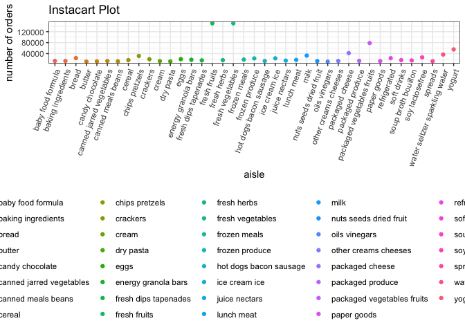

Data Science Homework 3
================
Laura Lynch
10/06/2019

Problem 1

``` r
library(p8105.datasets)
data("instacart")

instacart %>% view
```

The instacart dataset reflects the business of the instacart online groceryordering service. Order data includes the ailse and deartment information for the product as well as exactly when the order was placed and how frequently the customer uses the service. There are 21 departments and 39123 items to choose from which have been ordered by 131209 different customers.

-   There are 134 aisles and aisles most ordered from are:

``` r
instacart %>%
  select(aisle, product_id) %>%
  group_by(aisle) %>% 
  summarize(n_aisle = n()) %>%
  arrange(desc(n_aisle)) %>%
  head(3) %>%
  knitr::kable()
```

| aisle                      |  n\_aisle|
|:---------------------------|---------:|
| fresh vegetables           |    150609|
| fresh fruits               |    150473|
| packaged vegetables fruits |     78493|

-   This plot reflects the number of items ordered in each aisle

``` r
instacart %>%
  group_by(aisle) %>% 
  summarize(n_aisle = n()) %>%
  filter(n_aisle > 10000) %>%
  arrange(desc(n_aisle)) %>%
  ggplot(aes(x = aisle, y = n_aisle, color = aisle)) +
  geom_point() +
  labs(
    title = "Instacart Plot",
    x = "aisle",
    y = "number of orders") +
  theme(axis.text.x = element_text(angle = 90, hjust = 1))
```



-   This table shows the three most popular items in each of the aisles

instacart %&gt;% select(aisle = "baking incredients", "dog food care", "packaged vegetables fruits") %&gt;% pivot\_wider( names\_from = "aisle", values\_from = "count\_order" ) %&gt;% knitr::kable()

-   This table shows the mean hour of the day at which Pink Lady Apples and Coffee Ice Cream are ordered on each day of the week:

instacart %&gt;% select(product\_name = "Pink Lady Apples", "Coffee Ice Cream") %&gt;% mutate(mean\_time = mean(order\_hour\_of\_day)) %&gt;% pivot\_wider( names\_from = "order\_dow", values\_from = "mean\_time" ) %&gt;% knitr::kable()

Problem 2

library(p8105.datasets) data("dataset\_brfss")

dataset\_brfss %&gt;% view

Clean the `BRFSS Dataset`: dataset\_brfss %&gt;% janitor::clean\_names() %&gt;% \#format to appropriate cariavle names \#focus on the overall health topic \#include responses from excellent to poor \#organize responses as factor taking levels ordered from poor to excellent

-   In 2002, which states were observed at 7 or more locations?
-   What about in 2010?
-   Construct a dataset that is limited to Excellent responses, and contains, year, state, and a variable that averages the data\_value across locations within a state.
-   Make a “spaghetti” plot of this average value over time within a state (that is, make a plot showing a line for each state across years – the geom\_line geometry and group aesthetic will help).
-   Make a two-panel plot showing, for the years 2006, and 2010, distribution of data\_value for responses (“Poor” to “Excellent”) among locations in NY State.

Problem 3

accel\_data = read\_csv(file = "./data/accel\_data.csv") %&gt;% view(accel\_data)
